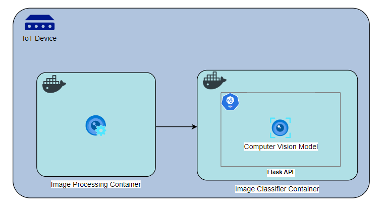

## Docker SVC Image Classification Model

This is a code that runs a machine learning model inside a docker container, which can be used to run a machine learning model on an iot device. It receives an image via post request using flask and in the specific computer vision model used, it predicts the class of the object in the image.

- Testing manually:

For testing, you can run the docker container with the bellow commands and then run the code from file call_container_API\call_inf_container_API.py. This code extracts images from cifar10 dataset based on the chosen index and sends it to the container.

- End-to-end iot application:

In a real-world iot app, it is desirable to have another docker container that reads images from the hardware and sends to the inference container. This is simulated by the container in call_container_API\mock_image_processing folder. Follow the instructions bellow and then go to the call_container_API\mock_image_processing folder and follow the instructions from the Run.md file using a different terminal window, to run the 2 containers at the same time and have them communicate with each other.

### To run the container:

#### Build the image:
- docker build -t svc-inference:test .
- docker images

#### Run image locally:

- docker run -p 9000:5000 svc-inference:test
<!-- - docker run --platform linux/amd64 -p 9000:8080 svc-inference:test -->

<!-- - curl "http://localhost:9000/test" -d '{"number": "10"}' -->
<!-- - curl "http://localhost:9000/2015-03-31/functions/function/invocations" -d '{"payload":"hello world!"}' -->

#### Util commands:

- docker ps
- docker kill <container_id>
- docker stop <container_id>
- docker rm <container_id>
- docker rmi -f <image_id>
- docker system prune -a

#### References:
- https://docker-curriculum.com/
- https://github.com/prakhar1989/docker-curriculum/tree/master/flask-app
- https://dev.to/victor_isaac_king/a-step-by-step-guide-to-deploying-a-machine-learning-model-in-a-docker-container-nkp